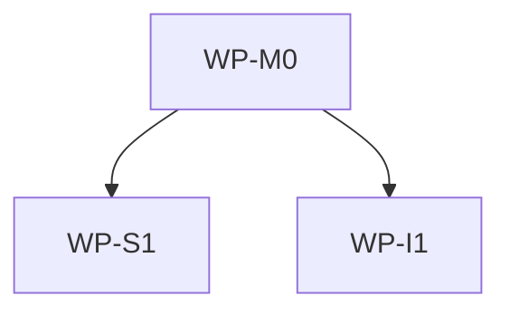

# <Spec title>

## Context

Why now. What triggered this. One paragraph.

## Goal

One behavioral sentence describing what will be true when this is shipped.

## Non-goals

Explicit list of what this spec is not solving.

- ...

## Constraints

Layer rules, performance, compatibility, governance. Anything that narrows the design space.
Include scope ownership when relevant: this spec may own only files in its resolved AIDLC scope and
must not claim files below a nested initialized scope.

- ...

## Affected files

Concrete paths the implementation will touch, relative to this spec's AIDLC scope root unless noted.
Avoid broad directory globs.

- `path/to/file`
- ...

## Work packages

| ID | Title | Domain | Layer | Wave | Depends on | Parallel? |
| --- | --- | --- | --- | --- | --- | --- |
| WP-M0 | ... | software | models | 0 | — | alone |
| ... | ... | ... | ... | ... | ... | ... |

## Dependency tree

## Parallel execution plan

| Wave | Work packages | Max parallel implementers |
| --- | --- | --- |
| 0 | WP-M0 | 1 |
| 1 | WP-I1, WP-U1 | 2 |
| 2 | WP-INT | 1 |

## Blueprint deltas

Which blueprint sections change and how. Required for medium/large: list concrete edits, or write
**None** with a one-line reason when no blueprint-owned concern changes.

- **`docs/blueprints/<module>.md` § <section>**: <what changes>

## Test plan

Named scenarios mapped to test gates.

- `tests/unit/<...>/test_<...>` — <scenario>
- `tests/integration/<...>/test_<...>` — <scenario>

## Open questions

Must be empty before status flips from `draft` to `approved`. If a question cannot be resolved, it
becomes a constraint or a non-goal.

- None.

## Implementation notes

Filled during execution. Amendments and discoveries go here, each with a short justification and
the date.

- ...
