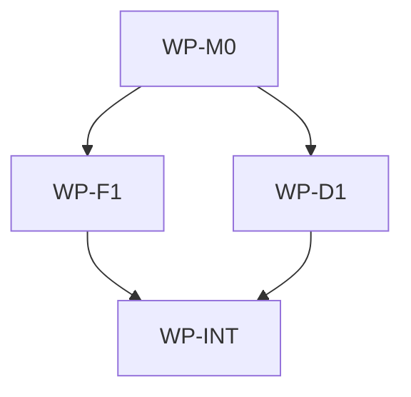

# Add aidlc Homebrew Formula

## Context

The `homebrew-aidlc` scope is currently initialized as a minimal tooling repository with no
`Formula/` source tree. The user wants this tap to install the `aidlc` CLI from the sibling source
repository at `/Users/shubhangtiwari/git/aidlc/aidlc/aidlc`, which introduces the tap's first public
installation behavior and a Homebrew packaging boundary.

## Goal

After this ships, users can install the `aidlc` CLI with the `shubhangtiwari/aidlc` Homebrew tap,
and the tap has documented Makefile verification gates for the formula.

## Non-goals

- Do not modify the upstream aidlc CLI source repository.
- Do not add a cask, prebuilt bottle workflow, or binary-only formula.
- Do not publish a new upstream aidlc release tag from this tap scope.
- Do not change generated governance files by hand.

## Constraints

- This spec owns only files in `/Users/shubhangtiwari/git/aidlc/homebrew-aidlc`.
- The template does not support `tooling` as a frontmatter domain, so this spec uses `software` and
  requires a tap-specific software/domain profile for the Homebrew packaging boundary.
- Repository commands must be executed through the root `Makefile`.
- The formula must use a stable GitHub source archive URL and a real SHA256 checksum.
- Latest local upstream tag observed before drafting is `aidlc/v0.4.0` at commit
  `eab93ae4f672faa01f7d0b8c2018e7e95cdd566b`; the implementer must verify the tag exists on
  `https://github.com/shubhangtiwari/aidlc.git` and compute the archive checksum before writing the
  formula.
- If no remotely verifiable release tag or source archive checksum can be resolved, implementation
  must stop and record the blocker instead of shipping a placeholder formula.
- The upstream Go module is nested at `aidlc/` with module path
  `github.com/shubhangtiwari/aidlc/aidlc`; the formula build must account for that nested module.
- The upstream license is MIT, so the formula should declare `license "MIT"` unless the verified
  release artifact says otherwise.

## Affected files

- `Formula/aidlc.rb`
- `README.md`
- `Makefile`
- `docs/ARCHITECTURE.md`
- `docs/architecture/software.md`
- `docs/blueprints/homebrew-tap.md`

## Work packages

| ID | Title | Domain | Layer | Wave | Depends on | Parallel? |
| --- | --- | --- | --- | --- | --- | --- |
| WP-M0 | Tap architecture and release contract | software | models | 0 | - | alone |
| WP-F1 | Homebrew formula | software | integrations | 1 | WP-M0 | with WP-D1 |
| WP-D1 | Tap documentation and command surface | software | api | 1 | WP-M0 | with WP-F1 |
| WP-INT | Integration verification and blueprint sync | software | integrations | 2 | WP-F1, WP-D1 | alone |

## Dependency tree

## Parallel execution plan

| Wave | Work packages | Max parallel implementers |
| --- | --- | --- |
| 0 | WP-M0 | 1 |
| 1 | WP-F1, WP-D1 | 2 |
| 2 | WP-INT | 1 |

## Blueprint deltas

- **`docs/blueprints/homebrew-tap.md` Section `Purpose and scope`**: Add the tap module as the
  owner of the Homebrew formula and user-facing install command surface.
- **`docs/blueprints/homebrew-tap.md` Section `Public contracts`**: Document the formula name,
  tap install command, installed `aidlc` binary, expected source release tag shape, and version
  metadata behavior.
- **`docs/blueprints/homebrew-tap.md` Section `Integration boundaries`**: Document Homebrew as the
  package manager boundary and `https://github.com/shubhangtiwari/aidlc.git` as a read-only
  upstream source boundary for release archives.
- **`docs/blueprints/homebrew-tap.md` Section `Test gates`**: Document that formula changes must
  pass the Makefile-wrapped Homebrew audit/style/install/test gates.

## Test plan

- `make test` - runs the tap's Homebrew formula verification through Makefile, including
  `brew audit` and `brew style` for `Formula/aidlc.rb`.
- `make test` - builds or installs the formula from source and runs the formula `test do` block
  through the Makefile.
- `make install` - installs the local formula from `Formula/aidlc.rb` after the formula exists.
- `make run` - runs the installed `aidlc` binary with a non-mutating command such as `aidlc version`
  or `aidlc --help`.
- Formula `test do` - exercises the installed binary and asserts expected output from `aidlc
  version` or `aidlc --help`.

## Open questions

- None.

## Implementation notes

- Drafted 2026-06-04: Local upstream tags include `aidlc/v0.4.0`, `aidlc/v0.3.0`,
  `aidlc/v0.2.0`, `aidlc/v0.1.2`, `aidlc/v0.1.1`, and `aidlc/v0.1.0`; remote verification and
  checksum computation are intentionally left to implementation because the formula must not ship
  guessed release metadata.
